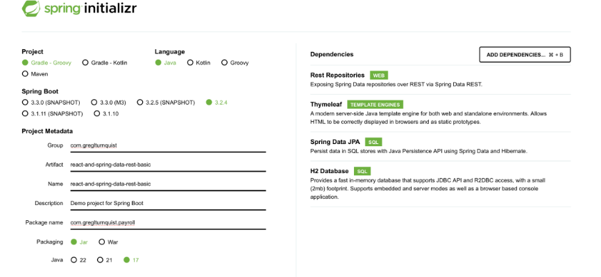

# Class Assignment 2 Part 1

## Introduction

The aim of this assignment was to work with a basic Gradle application to incorporate new functionalities and to
develop a deeper understanding of navigating the Gradle wrapper and making adjustments to the build.gradle setup.

### Initial steps

The first step consists in cloning the following repository: https://bitbucket.org/pssmatos/gradle_basic_demo/ to the
local machine, it will serve as the foundation in completing the tasks.

```bash
git clone https://bitbucket.org/pssmatos/gradle_basic_demo.git
```

The rest of the assignment can be done by opening a bash terminal and running the following commands:

1. Navigate to the project directory:
   ```bash
   cd path/to/gradle_basic_demo
   ```


2. Copy the application into the CA2/Part1 folder:
   ```bash
   cp -r . ../DevOpsRep/CA2/part1
   cd ../DevOpsRep/CA2/part1
   ```
3. Add all files to the staging area:
   ```bash
   git add .
   ```


4. Commit the files that were previously added:
   ```bash
   git commit -m "[Feat] Close #9 Cloned repository provided for the CA2 part1"
   ```

5. Push the commit to the remote repository:
   ```bash
   git push
   ```

### Task Completion- Implementation of Changes

#### Part 1: Addition of the runServer task

For this first section, the goal is to add a new task in the build.gradle file to start the server.

1. Open the build.gradle file that is present in the project and add the runServer task:

   ```gradle
   task runServer(type:JavaExec, dependsOn: classes){
    group = "DevOps"
    description = "Launches a chat server that listens to a client on localhost:59001"

    classpath = sourceSets.main.runtimeClasspath

    mainClass = 'basic_demo.ChatServerApp'

    args '59001'
   }

    ```

2. Run the runServer task in the terminal:

```bash
./gradlew runServer
```

3. Add and commit the changes:

```bash
git commit -a -m "Add a new task to update the server"
```

This Gradle script defines a task named "runServer" of type JavaExec, which means it will execute a Java class. This
task is configured to depend on the "classes" task, implying that it will run only after the compilation of the Java
classes is completed.
The argument "59001", indicating the port number on which the chat server will listen for client connections.

#### Part 2: Adding the Test Class and respective unit test

For the aforementioned task, a new test class and its unit test will be added:

1. Create a new test folder and a new test class:
   ```bash
   mkdir -p src/test/java/basic_demo
   touch src/test/java/basic_demo/AppTest.java
   ```


2. Add the unit test:

```java

@Test
public void testAppHasAGreeting() {
    App classUnderTest = new App();
    assertNotNull("app should have a greeting", classUnderTest.getGreeting());
}
```

3. Add the necessary junit dependencies in the build.gradle file:

```gradle
dependencies {
    // Use Apache Log4J for logging
    implementation group: 'org.apache.logging.log4j', name: 'log4j-api', version: '2.11.2'
    implementation group: 'org.apache.logging.log4j', name: 'log4j-core', version: '2.11.2'
    testImplementation 'junit:junit:4.12'
}
```

4. Compile the project:

```bash
./gradlew build
```

5. Add and commit the changes:

```bash
git commit -a -m "Add a simple unit test and update the gradle script so that it executes the test"
```

6. Push the previous changes to the remote repository:

```bash
git push
```

#### Part 3: Adding the Copy task

This part consists in creating a task to create a backup of the source of the application and copy it into a 'backup'
folder:

1. Open the build.gradle and add the backupSource task:

```gradle
task backupSource(type:Copy){
    group = "DevOps"
    description = "The source code is copied into the backup directory"

    from '/src'
    into '/backup'
}
```

5. Compile the project in the terminal:

```bash
./gradlew build
```

Run the backupSource task in the terminal:

```bash
./gradlew backupSource
```

6. Add and commit the changes:

```bash
git commit -a -m "Add a new task of type Copy to be used to make a backup of sources of the application."
```

7. Push the changes to the remote repository:

```bash
git push
```

#### Part 3: Adding the Zip task

The final part of the part 1 of this assignment consists in creating a task to zip the source files of the application
and copy it into the distributions folder:

1. Open the build.gradle file and add the zipSource task:

```gradle
task zipSource(type:Zip){
    group = "DevOps"
    description = "The source code gets zipped into a zip file"

    from '/src'
    archiveBaseName.set("source")
    archiveExtension.set("zip")
}

```

5. Compile the project in the terminal:

```bash
./gradlew build
```

Run the zipSource task in the terminal:

```bash
./gradlew zipSource
```

6. Add and commit the changes:

```bash
git commit -a -m "Add a new task of type Zip to be used to make an archive of the sources of the application"
```

7. Push the changes to the remote repository:

```bash
git push
```

8. Add a tag to mark the end of the first part of this assignment:

```bash
git tag ca2-part1
git push --tags
```

# Class Assignment 2 Part 2

## Introduction

In the second part of the assignment, we set up a Gradle Spring Boot project with frontend capabilities. We added the
required dependencies, a frontend plugin as well as tasks to copy the generated Jar file and to delete webpack files.
This was done in a new branch called "tut-basic-gradle" and then merged into the master branch at the end. Make sure to
create an issue corresponding to each task and close it in the commit message.

The initial step is to create a new branch named "tut-basic-gradle" to develop the work intended for this part.
The following command was executed to create the branch:

```bash
git branch tut-basic-gradle
```

After creating the branch, the following command was executed to switch to the previously created branch:

```bash
git checkout tut-basic-gradle
```

1. Head to [https://start.spring.io] to generate a new gradle spring boot project. Fill the fields and add the required
   dependencies, according to the image provided in the assignment:
   

2. Click on the "Generate" button below and download the project. Afterwards extract the files to the CA2/Part2 folder.

3. Open the project in IntelliJ and delete de **src** folder.

4. Copy the *src* folder from the Class Assignment 1 Part 1 to the project folder, in this case:

```bash
cp -r DevOpsRep/CA1/part1/src DevOpsRep/CA2/part2

```

5. Copy the *webpack.config.js* as well as the  *package.json* files from the Class Assignment 1 Part 1 to the project
   folder, in this case:

```bash
cp DevOpsRep/CA1/part1/webpack.config.js DevOpsRep/CA2/part2
6. Delete the **src/main/resources/static/built/** folder in your project folder:
```bash
rm -r src/main/resources/static/built/
```

7. In the *Employee.java* class, in your *src* folder of the Class Assignment 2 Part 2 that was previously copied,
   change all *javax.persistence* imports into *jakarta.persistence*.

8. Add all the files to the staging area:

```bash
git add .
```

9. Commit the changes:

```bash
git commit -m "[Feat] Close #14 Create a new branch "tut-basic-gradle", added required dependencies and files for the execution of the bootRun gradle command" (commit message of this assignment)
```

10. Push the changes to the repository:

```bash
git push
```

### Implementation of Changes

## Part 1: Addition of the frontend plugin

The aim of the following steps is to add a frontend plugin to our gradle project:

1. Open the build.gradle file and add the plugin (it must correspond to your Java version):

```gradle
 id "org.siouan.frontend-jdk17" version "8.0.0"
```

2. In the same file, add the frontend block with the following configuration:

```gradle
 frontend {
nodeVersion = "16.20.2"
assembleScript = "run build"
cleanScript = "run clean"
checkScript = "run check"
}
```

3. Still in the build.gradle file, update the scripts section in order to configure the execution of the webpack:

```gradle
"scripts": {
"webpack": "webpack",
"build": "npm run webpack",
"check": "echo Checking frontend",
"clean": "echo Cleaning frontend",
"lint": "echo Linting frontend",
"test": "echo Testing frontend"
},
```

4. Right before the scripts section in the build.gradle file, add the following packageManager:

```gradle
"packageManager": "npm@9.6.7",
```

5. Compile the project in the terminal with the following command(it must be executed in the project folder):

```bash
./gradlew build
```

6. Add all the files to the staging area with the following command:

```bash
git add .
```

7. Commit the changes with the following command:

```bash
git commit -m "[Feat] Close #15 Add a gradle plugin to enable the management of the frontend by gradle" (commit message of this assignment)
```

8. Push the changes to the repository with the following command:

```bash
git push
```

### Part 2: Addition of  the copyJar task

This part of the assignment involves adding a new task to copy the generated JAR file. Here's how to do it:

1. Open the build.gradle file and add the task:

```gradle
task copyJarFile(type: Copy) {
    dependsOn build

    from "$buildDir/libs"
    into "$projectDir/dist"
    include ".jar"
}
```

2. Once again compile the project in the terminal:

```bash
./gradlew build
```

3. Add all the files to the staging area with the following command:

```bash
git add .
```

4. Commit the changes with the following command:

```bash
git commit -m "[Feat] Close #16 Added a new task to copy the generated JAR file" (commit message of this assignment)
```

5. Push the changes to the repository with the following command:

```bash
git push
```

### Part 3: Addition the deleteWebpackFiles task

In this section of the assignment, we'll be adding a new task to delete the files generated by webpack. Here's how to do
it:

1. Open the build.gradle file and add the code below to create the task:

```gradle
task deleteFiles(type: Delete) {
    delete fileTree(dir: 'src/main/resources/static/built', include: '**/')
}
```

2. Include the following command to ensure that this task is automatically executed by the *clean* task:

```gradle
clean.dependsOn(deleteWebpackFiles)
```

3. Once more, compile the project in the terminal:

```bash
./gradlew build
```

4. Add all te files to the staging area:

```bash
git add .
```

5. Commit the changes:

```bash
git commit -m  "[Feat] Close #17 Add a task to gradle to delete all the files generated by webpack" (commit message of this assignment)
```

6. Push the changes to the repository:

```bash
git push
```

### Part 4: Branch Merge

The final step of this assignment is to merge the tut-basic-gradle branch into the main branch. Here's how to do it:

1. Switch to the master branch with the following command:

```bash
git checkout master
```

2. Merge the tut-basic-gradle branch into the master branch:

```bash
git merge --no-ff tut-basic-gradle
```

3. Push the changes to the repository:

```bash
git push
```

4. Add a tag to mark the end of the second part of this assignment and push it to the repository:

```bash
git tag ca2-part2
git push --tags
```

### Alternative Method: Maven

## Introduction

Maven can be used as an alternative to Gradle for executing the assignment's tasks. Both Maven and Gradle are build
automation tools commonly used in Java projects, and they offer similar functionality in terms of managing dependencies,
executing tasks, and building projects.

While Gradle uses a Groovy-based DSL for its build scripts, Maven utilizes an XML-based configuration file called
pom.xml. Maven has a wide variety of plugins that allow the execution of the previous tasks by gradle in the CA2 part 2
of can be used to execute tasks similar to those performed by Gradle plugins.

### Setting up Maven

1. The first step is to create a new folder, for example part2_maven in the DevOpsRep/CA2 folder to store the Maven
   project. It needs to include files such as the src folder, webpack.config.js, package.json,.mvn(remove the
   maven-wrapper.jar) mvnw, mvnw.cmd and the pom.xml. These can be found and copied from the DevOpsRep/CA1 folder.

* Create the folder:

```bash
mkdir DevOpsRep/CA2/part2_maven
```

* Example of some of copied files:

```bash
cp -r DevOpsRep/CA1/part1/src DevOpsRep/CA2/part2_maven
cp DevOpsRep/CA1/part1/webpack.config.js DevOpsRep/CA2/part2_maven
cp DevOpsRep/CA1/part1/package.json DevOpsRep/CA2/part2_maven
```

2. In this next step, we'll add the following plugin to the pom.xml file to copy the generated JAR file, which perform
   the task copyJarFile that was previously created, in a similar manner:

```xml

<plugin>
    <groupId>org.apache.maven.plugins</groupId>
    <artifactId>maven-resources-plugin</artifactId>
    <version>3.1.0</version>
    <executions>
        <execution>
            <id>copy-resources</id>
            <phase>install</phase>
            <goals>
                <goal>copy-resources</goal>
            </goals>
            <configuration>
                <outputDirectory>${project.basedir}/dist</outputDirectory>
                <resources>
                    <resource>
                        <directory>${project.build.directory}</directory>
                        <includes>
                            <include>*.jar</include>
                        </includes>
                    </resource>
                </resources>
            </configuration>
        </execution>
    </executions>
</plugin>
```

3. Afterwards we add the maven-clean plugin which is configured to delete files located in the
   src/main/resources/static/built directory in order to remover webpack-generated files as part of the build process:

```xml

<plugin>
    <artifactId>maven-clean-plugin</artifactId>
    <version>3.1.0</version>
    <configuration>
        <filesets>
            <fileset>
                <directory>${project.basedir}/src/main/resources/static/built</directory>
                <includes>
                    <include>**/*</include>
                </includes>
            </fileset>
        </filesets>
    </configuration>
</plugin>
```

## Execution of the tasks through the use of plugins

1. After changing the pom.xml file, we execute the Maven build lifecycle, which includes the compilation and packaging
   phases(installing the project). Here is the command to compile:

```bash
mvn compile
```

2. After compiling, execute the install command:

```bash
mvn install
```

3. In order to copy the JAR file in order to execute the previously added plugin, use the following command:

```bash
mvn resources:copy-resources
```

The file will be copied to the directory specified in the <outputDirectory> configuration parameter within the plugin.
In this case, it will be copied to the ${project.basedir}/dist directory.

4. To execute the clean plugin previously stated:

```bash
mvn clean
```

5. To run the Spring Boot application, you can use the following command:

```bash
mvn spring-boot:run
``` 

### Conclusion

In summary, both Gradle and Maven are capable tools for managing build tasks and dependencies in Spring Boot projects
with frontend functionalities.

Gradle offers flexibility with its Groovy-based DSL, allowing for easy customization of tasks and configurations. It
provides a concise syntax for declaring dependencies and plugins, along with robust features for handling the build
process.

Meanwhile, Maven utilizes an XML-based configuration approach, providing a structured setup for project configuration.
It comes with a broad range of built-in plugins and goals, making it suitable for many developers.

Throughout this assignment, we illustrated the setup of a Spring Boot project with frontend capabilities using both
Gradle and Maven. While the specific syntax and configuration nuances vary between the two tools, the primary goal of
creating a fully functional project remains consistent.

Ultimately, the choice between Gradle and Maven depends on factors like familiarity, project requirements, and team
preferences. Both tools offer unique strengths and can be effectively utilized for building and managing Java projects.

Repository URL: https://github.com/tiagopereiraswitch/devops-23-24-JPE-1231861
